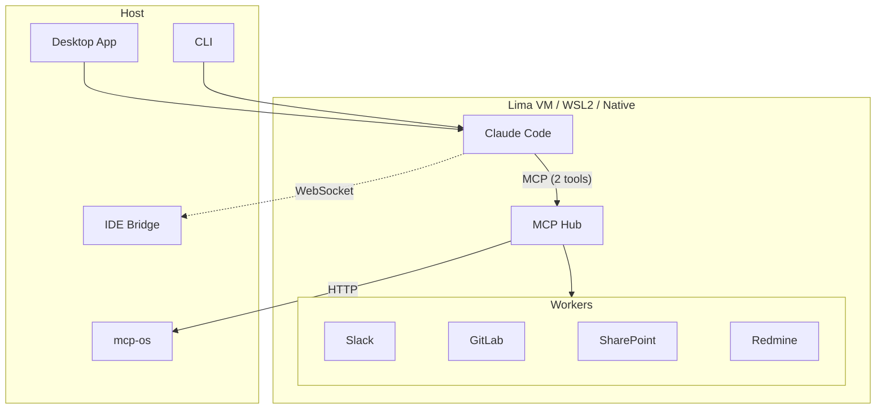

# Speedwave

**Security-first AI platform that connects [Claude Code](https://docs.anthropic.com/en/docs/claude-code) with your external services — without exposing a single credential to the AI.**

Speedwave wraps Claude Code in hardened, token-free containers and routes all service access through isolated MCP workers. Each worker sees only its own credentials, the AI sees none. Ships as a single installable app (.dmg / .exe / .deb) — no Docker Desktop required.

## Security Model

Speedwave treats security as a non-negotiable architectural constraint, not an add-on.

| Layer                          | What it does                                                                             |
| ------------------------------ | ---------------------------------------------------------------------------------------- |
| **Token-free AI container**    | Claude runs with zero credentials — it cannot access any service directly                |
| **Per-worker token isolation** | Each MCP worker mounts only its own service credentials (read-only)                      |
| **OWASP container hardening**  | `cap_drop: ALL`, `no-new-privileges`, read-only filesystem, restricted tmpfs             |
| **Kernel-level isolation**     | Lima VM (macOS), WSL2 (Windows), rootless user namespaces (Linux)                        |
| **Zero-token hub**             | The MCP Hub routes requests but holds no credentials — compromise exposes nothing        |
| **Network isolation**          | Per-project container networks prevent cross-project access                              |
| **PII tokenization**           | Sensitive data is replaced with opaque tokens before reaching the AI model               |
| **Sandbox hardening**          | Code execution sandbox with pattern denylist, restricted context, and execution timeouts |
| **SSRF protection**            | Allowlist-based URL validation with redirect blocking on all internal fetches            |

Even if an attacker escapes the sandbox, they land in a container with no tokens, no capabilities, and a read-only filesystem. **Defense in depth at every layer.**

→ [Full security model](docs/architecture/security.md) · [Security policy](SECURITY.md)

## MCP Hub — Smart Tool Discovery

Traditional MCP setups expose every tool directly to the AI, consuming context window with dozens of tool definitions. Speedwave takes a different approach.

The MCP Hub is the **only** MCP server Claude sees, and it exposes just **two tools**:

- **`search_tools`** — Claude describes what it needs; the Hub discovers matching tools across all enabled integrations and returns only the relevant ones
- **`execute_code`** — Claude writes JavaScript that calls the discovered tools; the Hub routes execution to the appropriate worker

This means Claude's context window stays clean regardless of how many integrations are enabled. Ten services with 50+ tools each? Claude still sees just two. The Hub handles discovery, routing, and — critically — **PII tokenization**: sensitive data from service responses is replaced with opaque tokens before reaching the model.

→ [Integrations & Hub architecture](docs/guides/integrations.md)

## Key Features

- **Two interfaces** — Desktop app (chat UI with project management) and CLI (`speedwave` terminal command)
- **Built-in integrations** — Slack, SharePoint, GitLab, Redmine, Mail, Calendar, Reminders, Notes
- **Plugin system** — extend with custom MCP services via Ed25519-signed plugins
- **Cross-platform** — macOS, Linux, Windows with platform-native OS integrations
- **Zero-install dependencies** — Lima, nerdctl, and containerd are bundled; no system-wide Docker or container runtime needed
- **IDE bridge** — connects Claude Code with your editor for seamless development

## Architecture

| Component       | Role                                                                                    |
| --------------- | --------------------------------------------------------------------------------------- |
| **Claude Code** | Hardened container — zero tokens, zero credentials, read-only filesystem                |
| **MCP Hub**     | Single entry point — exposes only `search_tools` + `execute_code`, tokenizes PII        |
| **Workers**     | Each mounts only its own service credentials (read-only), per-project network isolation |
| **mcp-os**      | Host process for native OS integrations (Mail, Calendar, Reminders, Notes)              |
| **IDE Bridge**  | WebSocket link between Claude Code in the container and your editor on the host         |

→ [Architecture overview](docs/architecture/README.md) · [Container topology](docs/architecture/containers.md) · [Platform matrix](docs/architecture/platform-matrix.md)

## Quick Start

1. Download the latest release for your platform from [GitHub Releases](https://github.com/speednet-software/speedwave/releases)
2. Install the application
3. Launch Speedwave and follow the setup wizard
4. Configure your integrations and start working

→ [Getting started guide](docs/getting-started/README.md) · [Configuration reference](docs/getting-started/configuration.md)

## Platform Support

| Platform | VM / Runtime                | Installer | OS Integrations       |
| -------- | --------------------------- | --------- | --------------------- |
| macOS    | Lima + Apple Virtualization | `.dmg`    | EventKit, AppleScript |
| Linux    | Rootless nerdctl (native)   | `.deb`    | CalDAV, zbus          |
| Windows  | WSL2 + Hyper-V              | `.exe`    | WinRT, MAPI (Outlook) |

→ [Platform details](docs/architecture/platform-matrix.md)

## Documentation

| Topic                  | Link                                                                             |
| ---------------------- | -------------------------------------------------------------------------------- |
| Getting started        | [docs/getting-started/](docs/getting-started/README.md)                          |
| Architecture           | [docs/architecture/](docs/architecture/README.md)                                |
| Security model         | [docs/architecture/security.md](docs/architecture/security.md)                   |
| CLI guide              | [docs/guides/cli.md](docs/guides/cli.md)                                         |
| Desktop guide          | [docs/guides/desktop.md](docs/guides/desktop.md)                                 |
| Integrations & plugins | [docs/guides/integrations.md](docs/guides/integrations.md)                       |
| IDE bridge             | [docs/guides/ide-bridge.md](docs/guides/ide-bridge.md)                           |
| Development setup      | [docs/contributing/development-setup.md](docs/contributing/development-setup.md) |
| Testing strategy       | [docs/contributing/testing.md](docs/contributing/testing.md)                     |
| Architecture decisions | [docs/adr/](docs/adr/README.md)                                                  |

## Contributing

We welcome contributions. See [CONTRIBUTING.md](CONTRIBUTING.md) for guidelines on bug reports, feature requests, development setup, and the PR process.

Please review our [Code of Conduct](CODE_OF_CONDUCT.md) before participating.

## Security

If you discover a vulnerability, **do not open a public issue**. See [SECURITY.md](SECURITY.md) for responsible disclosure instructions.

## License

[Apache License 2.0](LICENSE)
