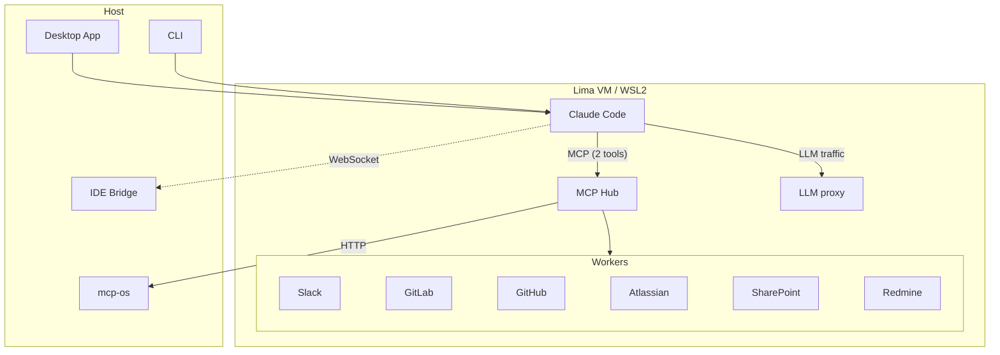

# Speedwave

**A controlled environment for AI coding agents.**

Speedwave is an open-source platform for running AI coding agents inside controlled development environments.

It creates an isolated runtime on the developer workstation and controls how agents access project files, credentials, development tools and external systems.

Developers keep their existing workflows and AI tools. Organisations get a consistent way to control and observe how agents interact with the development environment.

Speedwave Core is available under the [Apache 2.0 license](LICENSE).

## Why Speedwave exists

AI coding agents do more than generate code. They can read project files, execute commands and interact with repositories, issue trackers and other development tools.

In enterprise engineering environments, this creates a new control boundary:

- unnecessary access to source code and internal systems
- exposed credentials
- sensitive data sent to external models
- uncontrolled access to repositories and development tools
- inconsistent agent configurations across teams
- limited visibility into AI-assisted activity

Speedwave provides a controlled layer between AI coding agents and the development environment, without requiring teams to move development onto a new platform.

## How Speedwave works

Speedwave runs on the developer workstation and creates a controlled environment around the AI coding agent.

**Developer workstation → Speedwave → AI coding agent**

Speedwave controls:

- the runtime environment in which the agent operates
- access to development tools and external systems
- how credentials are separated from the agent
- how sensitive data is handled
- what activity and usage can be observed

## Who it is for

Speedwave is designed for organisations where:

- developers are already using or evaluating AI coding agents
- AI agents need access to source code, repositories and development tools
- Security or Platform Engineering needs control over that access
- teams need a consistent approach across multiple developers or projects
- development takes place in regulated or security-sensitive environments

Speedwave is built for:

- developers who want to use AI coding assistants safely
- engineering leaders who want to scale AI adoption without shadow AI
- security teams that need clearer control boundaries
- governance and compliance teams that need visibility and audit evidence

## What Speedwave is not

Speedwave is not an AI coding agent. It works around AI coding agents such as [Claude Code](https://docs.anthropic.com/en/docs/claude-code) rather than replacing them.

Speedwave is also not a complete compliance programme by itself. It provides technical controls, visibility and evidence that can support broader security, governance and audit processes.

## Core principles

- **Keep developers moving.** AI should improve delivery speed, not create a parallel approval burden.
- **Keep control boundaries clear.** AI should only access what it is allowed to access.
- **Keep credentials protected.** Assistants and models should not receive broad or unnecessary access to secrets.
- **Keep sensitive data safer.** Teams should reduce the risk of sensitive information being exposed in prompts or tool calls.
- **Keep activity reviewable.** AI-assisted work should leave evidence that teams can inspect when needed.

## Technical overview

Under the hood, Speedwave uses isolated environments, controlled tool access, credential separation, sensitive-data protection and audit logging to reduce the risks of AI-assisted development.

Key capabilities include:

- hardened local runtime
- token-free assistant container
- scoped MCP gateway
- isolated MCP workers
- credential isolation
- PII tokenisation
- local LLM support
- audit logging
- SIEM / OTEL-ready observability
- prompt-injection-aware design

## Quick start

1. Download the latest release for your platform (macOS `.dmg`, Windows `.exe`) from [GitHub Releases](https://github.com/speednet-software/speedwave/releases).
2. Install and launch Speedwave, then complete the setup wizard (it provisions the bundled container runtime: Lima on macOS, WSL2 on Windows).
3. Add a project and enable the integrations your team has approved.
4. Work in the Desktop chat UI, or run `speedwave` in a terminal to start a CLI session.

Full installation guide and first-session walkthrough: [speedwave.dev/docs](https://speedwave.dev/docs).

## Architecture

The assistant runs in a hardened container inside a VM (Lima on macOS, WSL2 on Windows). It holds no credentials: all service access goes through the MCP Hub to isolated per-integration workers, and all model traffic goes through a per-project LLM proxy.

```mermaid
graph TB
    subgraph Host[" Host "]
        APP[Desktop App] & CLI[CLI]
        IDE[IDE Bridge]
        MCP_OS[mcp-os]
    end

    subgraph VM[" Lima VM / WSL2 "]
        CLAUDE[Claude Code]
        HUB[MCP Hub]
        PROXY[LLM proxy]
        subgraph Workers[" Workers "]
            direction LR
            SLACK[Slack] ~~~ GITLAB[GitLab] ~~~ GITHUB[GitHub] ~~~ ATLASSIAN[Atlassian] ~~~ SP[SharePoint] ~~~ REDMINE[Redmine]
        end
    end

    APP & CLI --> CLAUDE
    CLAUDE -- "MCP (2 tools)" --> HUB
    CLAUDE -- "LLM traffic" --> PROXY
    CLAUDE -. "WebSocket" .-> IDE
    HUB --> Workers
    HUB -- "HTTP" --> MCP_OS
```

| Component       | Role                                                                                                          |
| --------------- | ------------------------------------------------------------------------------------------------------------- |
| **Claude Code** | Hardened container: zero tokens, zero credentials, read-only filesystem                                       |
| **MCP Hub**     | The only MCP server the assistant sees: exposes `search_tools` + `execute_code`, tokenizes PII                |
| **LLM proxy**   | Per-project forwarder for model traffic (Anthropic passthrough or approved local providers), records usage    |
| **Workers**     | One container per integration; each mounts only its own service credentials (read-only), per-project networks |
| **mcp-os**      | Host process for native OS integrations (Mail, Calendar, Reminders, Notes)                                    |
| **IDE Bridge**  | WebSocket link between the assistant container and your editor on the host                                    |

Model usage and cost are logged per project, diagnostics are collectable for review, and telemetry can be exported via OTLP to your own collector, including organisation-enforced configuration via MDM policy.

The full architecture series is in the "Under the Hood" section of the [documentation](https://speedwave.dev/docs).

## Security model

Speedwave is designed to limit what AI can see, access and do. It focuses on:

- reducing unnecessary model context exposure
- keeping credentials outside the assistant environment
- routing tool usage through controlled integrations
- protecting sensitive values before model exposure
- logging AI-assisted activity for review

## Limitations

Speedwave does not replace secure development practices, code review, access management, secrets management or organisational AI policies.

It helps create safer boundaries and evidence around AI-assisted development, but it should be deployed as part of a broader engineering, security and governance model.

## Core and Enterprise

**Speedwave Core** is open source under the Apache 2.0 license. Organisations can inspect, deploy, modify and operate it independently.

**Speedwave Enterprise** is for organisations that want to deploy and operate Speedwave as a managed standard across engineering teams, with central management, organisational rollout, lifecycle management and ongoing support.

Running Speedwave at organisational scale? [Learn about Speedwave Enterprise](https://speedwave.dev/#enterprise)

## Documentation

- User and developer documentation: [speedwave.dev/docs](https://speedwave.dev/docs)
- Architectural decisions: [docs/adr/](docs/adr/README.md)
- Contributor working rules: [.claude/rules/](.claude/rules/)
- Product roadmap: [speedwave.dev/roadmap](https://speedwave.dev/roadmap/)

## Contributing

See [CONTRIBUTING.md](CONTRIBUTING.md) for bug reports, feature requests, development setup, and the PR process. Please review the [Code of Conduct](CODE_OF_CONDUCT.md) before participating.

## Security

If you discover a vulnerability, **do not open a public issue**. See [SECURITY.md](SECURITY.md) for responsible disclosure instructions.

## License

Speedwave core is available under the [Apache 2.0 license](LICENSE).
