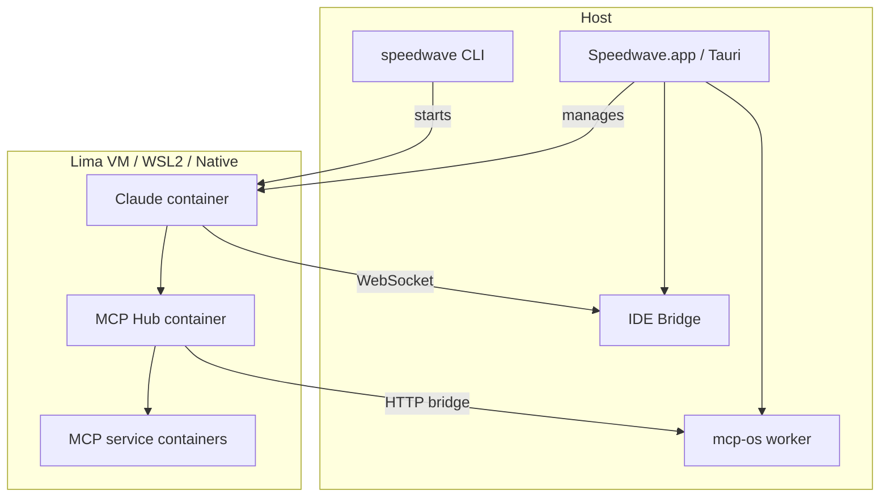

# Architecture Overview

Speedwave is an orchestration layer that manages containers, MCP servers, and IDE integration — all bundled into a single installable application.

## System Diagram

## Components

<!-- Content to be written: detailed component descriptions, data flow, communication protocols -->

## Key Design Decisions

See [ADR Index](../adr/README.md) for all architectural decisions.

## See Also

- [Security Model](security.md)
- [Containers](containers.md)
- [Platform Matrix](platform-matrix.md)
- [Bundled Resources](bundled-resources.md) — what Speedwave injects into the Claude container
