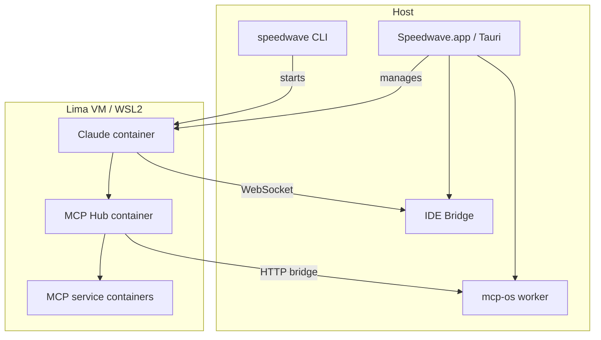

# Architecture Overview

Speedwave is an orchestration layer that manages containers, MCP servers, and IDE integration — all bundled into a single installable application.

## System Diagram

```mermaid
graph TD
    subgraph Host
        APP[Speedwave.app / Tauri]
        MCP_OS[mcp-os worker]
        IDE[IDE Bridge]
        CLI[speedwave CLI]
    end

    subgraph "Lima VM / WSL2"
        CLAUDE[Claude container]
        HUB[MCP Hub container]
        WORKERS[MCP service containers]
    end

    APP --> MCP_OS
    APP --> IDE
    APP --> |manages| CLAUDE
    CLI --> |starts| CLAUDE
    CLAUDE --> HUB
    HUB --> WORKERS
    HUB --> |HTTP bridge| MCP_OS
    CLAUDE --> |WebSocket| IDE
```

## Components

The diagram above splits into **host-side** processes (Tauri app, CLI, host MCP workers, IDE bridge) and **VM-side** containers (Claude, the MCP Hub, per-service workers). The boundary is the security boundary: tokens and host-reaching capabilities live on the host, while Claude runs token-free inside the VM.

| Component                  | Where          | Role                                                                                                                                                 |
| -------------------------- | -------------- | ---------------------------------------------------------------------------------------------------------------------------------------------------- |
| **Speedwave.app / Tauri**  | Host           | Desktop UI + the runtime orchestrator. Manages the Lima VM / WSL2 distro, renders per-project compose, and starts/stops containers.                  |
| **speedwave CLI**          | Host           | Terminal entry point. Starts the same containers and launches Claude Code's TUI inside the `claude` container.                                       |
| **Host MCP workers**       | Host           | Workers that need host APIs Claude must never hold — `mcp-os` (Calendar/Mail/Reminders/Notes), `oauth`. Reached over an HTTP bridge.                 |
| **IDE Bridge**             | Host           | Writes `~/.speedwave/ide-bridge/<port>.lock`, mounted into the container as `~/.claude/ide/`, so VS Code / JetBrains can attach to the session.      |
| **Claude container**       | Lima VM / WSL2 | The hardened, token-free container where Claude Code runs. Sees only the MCP Hub; has no service credentials and no container socket.                |
| **MCP Hub container**      | Lima VM / WSL2 | The single MCP endpoint Claude sees (port 4000). Discovers and routes to enabled workers; holds zero tokens.                                         |
| **MCP service containers** | Lima VM / WSL2 | Per-service workers (Slack, SharePoint, GitLab, GitHub, Atlassian, Redmine, Office, Playwright, Context7) each mounting only their own `/tokens:ro`. |

Communication paths: Claude → Hub (MCP), Hub → workers (HTTP, Docker DNS for in-VM workers; `WORKER_*_URL` host bridge for host workers), Claude ↔ IDE Bridge (WebSocket via the lock file mount).

For detail see [Containers](containers.md) (image topology, compose template), [Security Model](security.md) (token isolation, hardening, threat model), [Platform Matrix](platform-matrix.md) (macOS vs Windows), and the [Guides](../guides/integrations.md).

## Key Design Decisions

See [ADR Index](../adr/README.md) for all architectural decisions.

## See Also

- [Security Model](security.md)
- [Containers](containers.md)
- [Platform Matrix](platform-matrix.md)
- [Bundled Resources](bundled-resources.md) — what Speedwave injects into the Claude container
